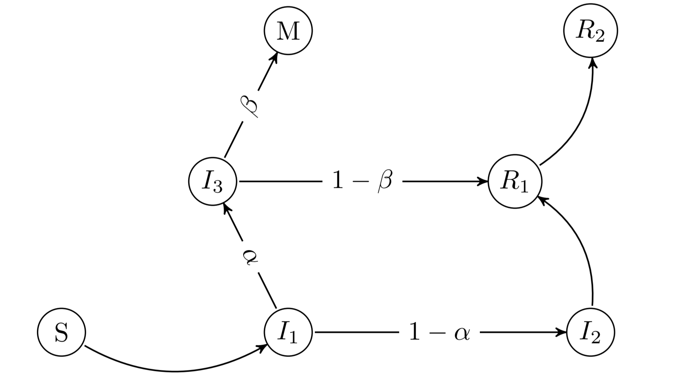

## COVID-19 diffusion model  

Dynamics are generated according to a probabilistic model which is represented by the graph. Underlying daily reproduction number is estimated as a function of time by solving an inverse problem. 

Visualization of estimations based on data provided by the Government [here](https://mmatabuena.github.io/forecastCovid/.) :point_left:

Or just direct access:

* :chart_with_upwards_trend: __[Galicia](https://mmatabuena.github.io/forecastCovid/Rmds/Espana/Galicia/main.html)__
* :chart_with_upwards_trend: __[Navarra](https://mmatabuena.github.io/forecastCovid/Rmds/Espana/Navarra/main.html)__
* :chart_with_upwards_trend: __[Madrid](https://mmatabuena.github.io/forecastCovid/Rmds/Espana/Madrid/main.html)__
* :chart_with_upwards_trend: __[Castilla y León](https://mmatabuena.github.io/forecastCovid/Rmds/Espana/Leon/main.html)__
* :chart_with_upwards_trend: __[País Vasco](https://mmatabuena.github.io/forecastCovid/Rmds/Espana/Vasco/main.html)__
* :chart_with_upwards_trend: __[Cataluña](https://mmatabuena.github.io/forecastCovid/Rmds/Espana/Cataluna/main.html)__

All the methodology shown in this web is described in the [arXiv publication](https://arxiv.org/abs/2004.13695) "Estimating spread in Spain solving an inverse problem with a probabilistic model".

### Support and contact

Problems with this pages? Check [documentation](https://help.github.com/categories/github-pages-basics/) or [contact support](https://github.com/contact) and we will help you to solve it. 

### Disclaimer
This tool uses a mathematical model to simulate a variety of COVID-19 outcomes. This output of the model depends on model assumptions and parameter choices. It is not a medical predictor, and should be used for informational and research purposes only. Interpret and use the simulated results responsibly. Authors are not liable for any direct or indirect consequences of this usage.
