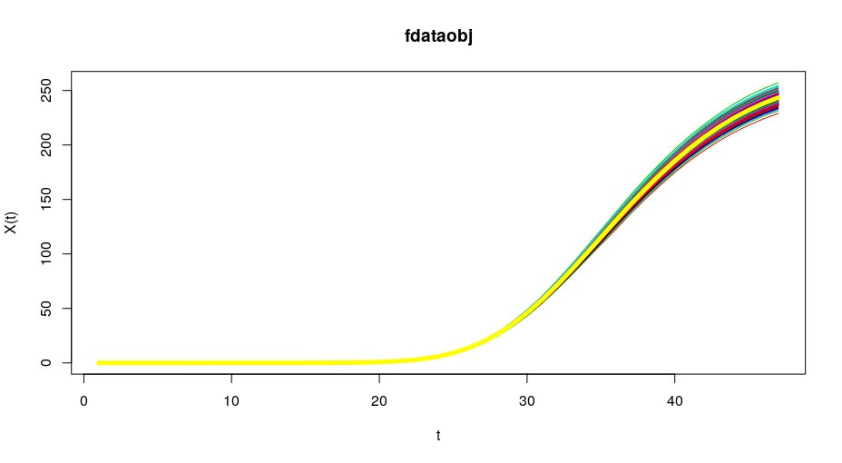

## Modelo do Covid 19 baseado en ...  

Voltar a páxina principal [www.forecastCovid](https://mmatabuena.github.io/forecastCovid/.)

### Soporte e contacto

Tes problemas cas paxinas? Comproba a documentación [documentation](https://help.github.com/categories/github-pages-basics/) or [contact support](https://github.com/contact) e axudaremoste a resolvelo.
