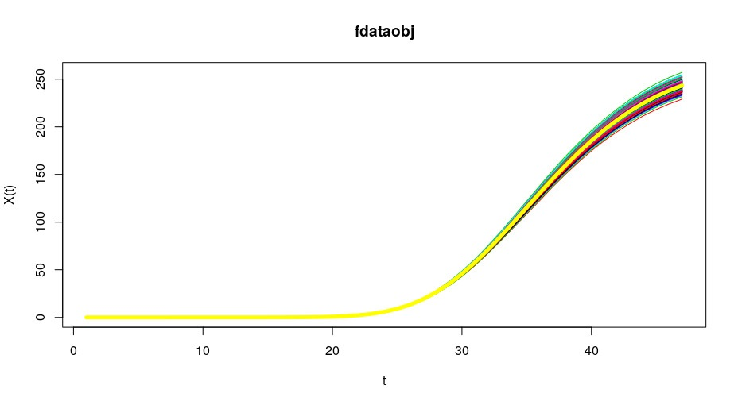

## Modelo do Covid 19 baseado en ...  

Web con visualización de datos aportados polo Goberno: [https://mmatabuena.github.io/forecastCovid/real.](https://mmatabuena.github.io/forecastCovid/Rmds/real/index.html)

* :bar_chart: __[Galicia](https://mmatabuena.github.io/forecastCovid/Rmds/galicia/main.html)__
* :bar_chart: __[Madrid](https://mmatabuena.github.io/forecastCovid/Rmds/madrid/main.html)__
* :bar_chart: __[Castilla y León](https://mmatabuena.github.io/forecastCovid/Rmds/cl/index.html)__
* :bar_chart: __[Cataluña](https://mmatabuena.github.io/forecastCovid/Rmds/cat/index.html)__
* :bar_chart: __[País Vasco](https://mmatabuena.github.io/forecastCovid/Rmds/pv/index.html)__

### Soporte ou Contacto
Tes problemas con esta páxina? Revisa a [documentación](https://help.github.com/categories/github-pages-basics/) ou [contacta co soporte](https://github.com/contact) e intentaremos resolvelo.
