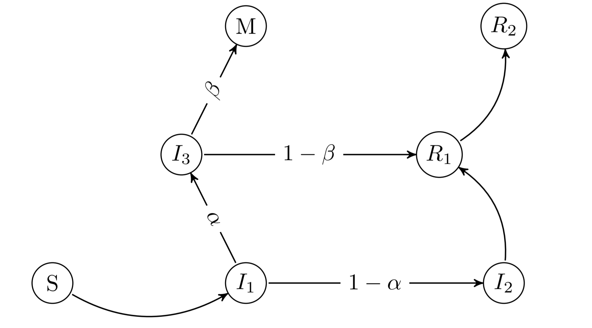

## Modelo de difusión da COVID-19  

A dinámica está xerada por un modelo probabilísitico representado no grafo. O número reprodutivo subxacente é unha función do tempo estimada resolvendo un problema inverso. 

Web con visualización de datos aportados polo Goberno [aquí](https://mmatabuena.github.io/forecastCovid/.) :point_left:

Ou acceda directamente:

* :chart_with_upwards_trend: __[Galicia](https://mmatabuena.github.io/forecastCovid/Rmds/Espana/Galicia/main.html)__
* :chart_with_upwards_trend: __[Navarra](https://mmatabuena.github.io/forecastCovid/Rmds/Espana/Navarra/main.html)__
* :chart_with_upwards_trend: __[Madrid](https://mmatabuena.github.io/forecastCovid/Rmds/Espana/Madrid/main.html)__
* :chart_with_upwards_trend: __[Castilla y León](https://mmatabuena.github.io/forecastCovid/Rmds/Espana/Leon/main.html)__
* :chart_with_upwards_trend: __[País Vasco](https://mmatabuena.github.io/forecastCovid/Rmds/Espana/Vasco/main.html)__
* :chart_with_upwards_trend: __[Cataluña](https://mmatabuena.github.io/forecastCovid/Rmds/Espana/Cataluna/main.html)__

Toda a metodoloxía empregada para construir as gráficas de esta web está descrita na publicación de [arXiv](https://arxiv.org/abs/2004.13695) "Estimating spread in Spain solving an inverse problem with a probabilistic model".

### Soporte ou Contacto
Tes problemas con esta páxina? Revisa a [documentación](https://help.github.com/categories/github-pages-basics/) ou [contacta co soporte](https://github.com/contact) e intentaremos resolvelo.

### Descargo de responsabilidade
Esta ferramenta matemática simula multiples escenarios para a COVID-19. A saída do modelo depende das suposicións do mesmo e da elección correcta dos parámetros. Non e un preditor médico, e debe ser empregado tan só como medio informativo e de desenvolvemento. Os autores non se responsabilizan das consecuencias directas ou indirectas do seu uso.
