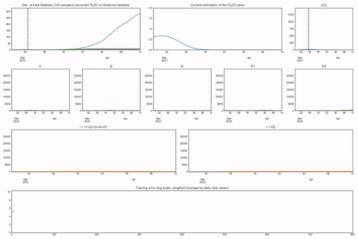
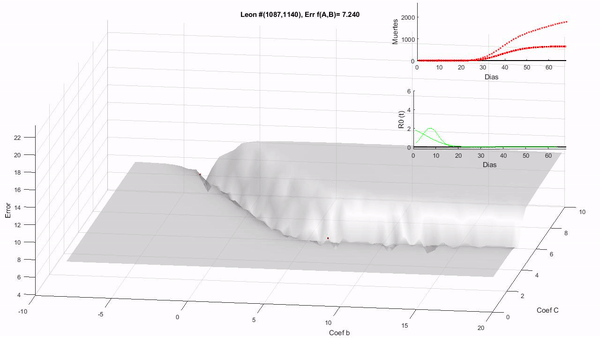

# Welcome, please select your Language  

## :point_right: [Or go to website](https://mmatabuena.github.io/forecastCovid/.)

Performance of evolution strategy algorithm optimizing model parameters

| R0 Fit using CMAES  | 3D Sample Map with CMAES jumps  |
| ------------- | ------------- |
|  |  |

**NOTE**: A new Web is also under construcction: [Website](https://github.com/covid19-modeling)

